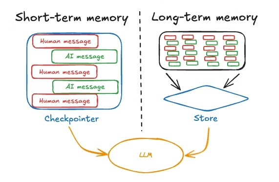
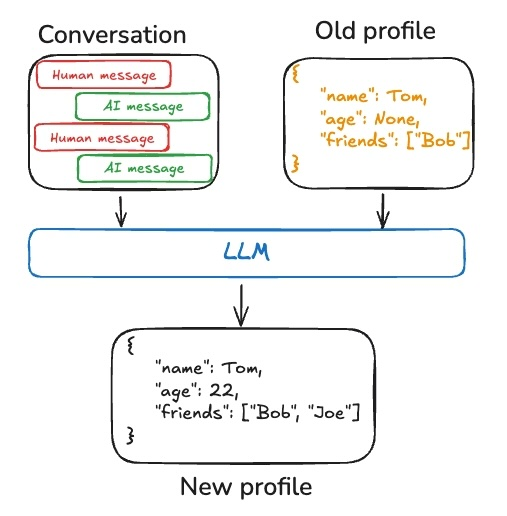
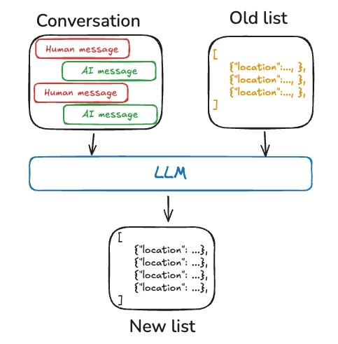
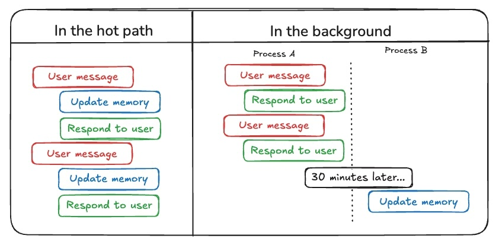

# Module 6: 🧠 Agent Memory

🎯 **Goal**: Understand how to build agents capable of managing both short and long-term memory stores

📚 **Learning Outcomes**
- Understand short vs. long term memory in agentic systems and how to manage them
- Learn the two primary methods for agents to write memories: in the hot path (e.g., during runtime) and in the background
- Visualize, debug, and interact with your agent applications

🧰 **New Tools**
- Visualization, Interaction, and Debugging: [LangSmith Studio](https://docs.langchain.com/langsmith/studio)

## 📛 Required Tooling & Account Setup
- No new tools or accounts required.
   
## 📜 Recommended Reading
1. [Memory Overview](https://docs.langchain.com/oss/python/concepts/memory), by LangGraph

# **🗺️ Overview**

In module 6, we dig into Agent Memory! You should use memory in your agent systems, because the user experience is much better when you do. When your AI remembers and learns from previous interactions, you can provide truly awesome, personalized user experiences.

> “Memory fundamentally changes what we can do with these systems, fundamentally changes how we can interact with them.” ~ The Wiz, [Agent Memory](https://www.youtube.com/live/MYzuyEtKto4?si=yEZFp8qmkWk8WzZg), January 7, 2026
> 

The core **concepts** we'll cover include breaking down memory into short- and long-term (including it’s variations), how to understand the technical distinction between chat history in the context window and memory proper, and how memory mechanisms are, in the end, about how they make our production AI applications *viscerally feel better* than their naive counterparts.

 how to understand the difference between memory and the context window the big idea behind the definition of an agent that's [been agreed upon](https://simonwillison.net/2025/Sep/18/agents/) by the industry; that is, that "an LLM agent runs tools in a loop to achieve a goal." We'll take this idea further and discuss the "agent harness" as well. In addition, we'll cover a bit of the history of Langchain and its evolution to v1.0.

The core **code** we'll cover mimics the big ideas of short- and long-term memory through the lens of the [**Cognitive Architectures for Language Agents (**CoALA) Framework](https://arxiv.org/abs/2309.02427) applied to our Personal Wellness Agent. We will learn about the core components in LangGraph including the `checkpointer` (short-term) versus the `store` (long-term), how to `trim_messages` and `summarize` for context management, how to actively store and retrieve profiles, enable “semantic memory” (think RAG for memories), and how to store few-shot examples (think Prompt Engineering for memories). Finally, we’ll look at how procedural memory might be used in a store-and-reflect pattern to become self-improving. We’ll put it all together into a unified agent!

# 🧠 Memory

> Memory is a system that remembers information about previous interactions. [[Ref](https://docs.langchain.com/oss/python/concepts/memory)]
> 

Building state-of-the-art production applications for real, sophisticated users requires memory. It is an essential feature that makes applications *feel worthy of “co-worker”* status*.* 

To think about implementing great UX like this, let’s consider the dimension of time and ask:  “*What kind of data should my AI application remember, and on what time horizon, to produce great experiences for my users?”*

Answering this question gives way to the ideas of short- and long-term memory.

  

## **Short-Term Memory ( a.k.a. “Thread-Scoped”)**

> [**Short-term memory**](https://docs.langchain.com/oss/python/langgraph/add-memory#add-short-term-memory) lets your application remember previous interactions within a single [**thread**](https://docs.langchain.com/oss/python/langgraph/persistence#threads) or conversation. [[Ref](https://docs.langchain.com/oss/python/concepts/memory#short-term-memory)]
> 

Think of short-term memory as existing within a single conversation session or thread. We say that it *persists* across the thread/conversation, or that it is “thread-scoped.” 

It's similar to maintaining a chat history in context, and thus comes with the inherent limitation of the context window. Think of it as the **working memory** of your agent during an active session.

## **Long-Term Memory (Cross-Session)**

> [**Long-term memory**](https://docs.langchain.com/oss/python/langgraph/add-memory#add-long-term-memory) in LangGraph allows systems to retain information across different conversations or sessions. [[Ref](https://docs.langchain.com/oss/python/concepts/memory#long-term-memory)]
> 

This sounds easy, but it’s super hard to get right. In a perfect world, it enables agents to remember user preferences, past interactions, and learned behaviors beyond individual conversations. 

The challenge here is carefully managing what to keep versus what to discard as memories accumulate over time.

This brings up two important questions:

1. What ***type*** of memory are we talking about?
2. How should we *update memories over **time*** (here again, our friend the time dimension…)?

Let’s talk about types of memory, and in doing so, we’ll encounter our good friend time again. There are three types that we have anthropomorphized onto the agents: semantic, episodic, and procedural. 

At a glance, we can consider the [**Cognitive Architectures for Language Agents (**CoALA) Framework](https://arxiv.org/abs/2309.02427) mapping:

| **Memory Type** | **What is Stored** | **Human Example** | **Agent Example** |
| --- | --- | --- | --- |
| [**Semantic**](https://docs.langchain.com/oss/python/concepts/memory#semantic-memory) | Facts | Things I learned in school | Facts about a user |
| [**Episodic**](https://docs.langchain.com/oss/python/concepts/memory#episodic-memory) | Experiences | Things I did | Past agent actions |
| [**Procedural**](https://docs.langchain.com/oss/python/concepts/memory#procedural-memory) | Instructions | Instincts or motor skills | Agent system prompt |

### Semantic Memory (Facts)

Semantic means storing facts. We want to retrieve those facts from previous interactions to personalize our applications.

Anytime you see “semantic,” you should immediately be thinking “RAG,” “embedding space,” “similarity of words,” “K-nearest neighbors,” etc. We’re looking for stuff that *means the same thing*. That said, note that we have a poverty of language here, so don’t think it too hard:

> Semantic memory is different from “semantic search,” which is a technique for finding similar content using “meaning” (usually as embeddings). Semantic memory is a term from psychology, referring to storing facts and knowledge, while semantic search is a method for retrieving information based on meaning rather than exact matches. [[Ref](https://docs.langchain.com/oss/python/concepts/memory#semantic-memory)]
> 

There are two ways to think about implementing semantic memory; one is more akin to a “keyword search” vibe, and the other is more of a “semantic search."

Profiles 

> Memories can be a single, continuously updated “profile” of well-scoped and specific information about a user, organization, or other entity (including the agent itself). A profile is generally just a JSON document with various key-value pairs you’ve selected to represent your domain.
> 

  

Collection

> Alternatively, memories can be a collection of documents that are continuously updated and extended over time. Each individual memory can be more narrowly scoped and easier to generate, which means that you’re less likely to **lose** information over time.
> 

  

As you can imagine, maintaining the collection can be, well, quite difficult.

### Episodic Memory (Experiences)

Episodic memory means recalling episodes, duh. It’s useful for showing agents "how to do something they did before."

Think of past events or actions/interactions. This is super easy to implement, few-shot learning, but there are other ways too - kind of a lot of them.  We can use dynamic example selection from LangSmith datasets, or parent-document retrieval (as we will in our advanced retrieval module!) for full interaction context. 

Going up a level, we can use *similarity search* to find the most relevant *few-shot examples* (e.g., RAG on a db of prompts!).

Isn’t it weird how much we keep hearing the word retrieval?

### Procedural Memory (Rules)

Procedural memory encodes rules, procedures, and behavioral guidelines.

If that last one starts to sound like alignment and training, you’re not wrong. That's why this kind of memory often manifests in system prompts and instructions, *fine-tuned model weights*, tool configurations, and the overall agent program structure. Unlike other memory types, procedural memory can be dynamically updated based on user feedback, allowing the agent to evolve its core behaviors over time.

### Writing Memory (a.k.a. remembrance of time, again)

And so we arrive at the question - when should we write memories?

The answer is easy in a sense: either `right now`, or `later`. We call this “in the hot path” (e.g., at runtime) versus “in the background.”

Writing memory during runtime provides real-time updates and immediate reflection of changes, but introduces increased latency and complexity during agent execution. This approach is best for immediate user corrections. 

Background processing, on the other hand, avoids runtime latency impacts but results in delayed memory updates and potential inconsistencies. This method works well for summarization and episodic storage.

  

## Memory Isn't New—It's Context Engineering

It's going to feel a lot like we're talking about systems we already know about; e.g., 

- Semantic memory = RAG (retrieval-augmented generation)
- Episodic memory = Few-shot learning
- Procedural memory = Prompt engineering and fine-tuning

At the end of the day, memory asks “what should I put into context right now to answer the user’s query?”

## Production Readiness Requires Memory Mastery

Optimizing at the memory level indicates advanced competency. If you’re able to optimize at the memory level, you’re probably able to do a lot of other things well. And that is an indication of competence; of how advanced your builds are, and how useful you can be in industry.

The "stupid ChatGPT" and “simple chatbots” frustration of systems that don't remember will become unacceptable, if it hasn’t already. The bar is being raised for AI engineers—people will expect flawless, memory-enabled experiences.

## Practical Trade-offs in Memory Design

Memory implementation requires constant trade-offs; e.g.,

- Profile-based vs. collection-based semantic memory depends entirely on your use case
- A travel planning app needs to remember food preferences; a CI/CD agent needs to remember test requirements and latency expectations
- Sometimes you want the richness of full document retrieval, sometimes you want the precision of a well-scoped profile

When you're talking about memory, you must understand what moves the needle for the user. It's not about implementing all the memory types—it's about understanding which memories matter for your specific application.

We believe that memory will be a defining topic for 2026

