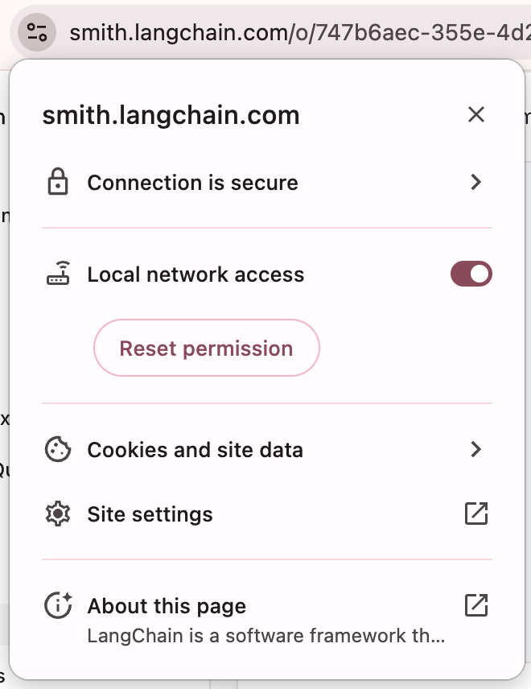

<p align="center" draggable="false">
</p>

## <h1 align="center" id="heading">Module 6: Agent Memory</h1>

### [Quicklinks](https://github.com/AI-Maker-Space/AIE9/tree/main/00_AIE_Quicklinks)

| Module Sheet | Recording     | Slides        | Repo         | Homework      | Feedback       |
|:-----------------|:-----------------|:-----------------|:-----------------|:-----------------|:-----------------|
| [Agent Memory](../00_Docs/Modules/06_Agent_Memory/README.md) | Coming soon!| [Module 6 Slides](https://www.canva.com/design/DAHA9EgZhrs/yMlmJQwBRCFHxvPvVyhlTQ/edit?utm_content=DAHA9EgZhrs&utm_campaign=designshare&utm_medium=link2&utm_source=sharebutton) | You are here! | [Module 6 Assignment: Memory](https://forms.gle/vyYhAsbZdgLZSu3RA) | [Feedback 2/10](https://forms.gle/k1cESPgXsYWrBTDU7) |


### Outline:

**BREAKOUT ROOM #1: Memory Foundations & LangGraph Studio**
- Task 1: Dependencies & LangGraph Studio Setup
- Task 2: Understanding Agent Memory (CoALA Framework)
- Task 3: Short-Term Memory (MemorySaver, thread_id)
- Task 4: Long-Term Memory (InMemoryStore, namespaces)
- Task 5: Message Trimming & Context Management
     - **Activity #1**: Store & Retrieve User Investment Profile

**BREAKOUT ROOM #2: Advanced Memory & Integration**
- Task 6: Semantic Memory (Embeddings + Search)
- Task 7: Building Semantic Investment Knowledge Base
- Task 8: Episodic Memory (Few-Shot Learning)
- Task 9: Procedural Memory (Self-Improving Agent)
- Task 10: Unified Investment Memory Agent
     - **Activity #2**: Investment Memory Dashboard

### Prerequisites:

#### 1. API Keys Required

You'll need API keys for:
- **OpenAI** - For GPT-5.2 and embeddings
- **LangSmith** - For tracing and debugging

Copy the sample environment file and fill in your API keys:
```bash
cp .env.sample .env
# Then edit .env with your actual API keys
```

#### 2. LangGraph Studio

LangGraph Studio provides a visual interface for debugging and inspecting your memory-enabled agents:

```bash
# Run the development server (from this directory)
uv run langgraph dev
```

> NOTE: If you're on a Mac and using Chrome - you may need to enable local network access via the provided screenshot.



Features:
- Graph visualization
- State inspection at each step
- Time-travel debugging
- Memory store viewer

# Build

Run the notebook!

# Ship

- Customize your memory-enabled agent with one of the following enhancements:
     - Implement a different storage backend (SQLite, PostgreSQL, Redis)
     - Add memory expiration/TTL policies
     - Create a multi-user memory system with privacy controls
     - Build a memory visualization dashboard
- Create a diagram showing your memory architecture
- Record a Loom video walking through the notebook, the questions, and your enhancements!

# Share

- Show your memory architecture diagram in a Loom video and explain the memory flow
- Make a social media post about your memory-enabled investment agent and tag @AIMakerspace
- Share 3 lessons learned
- Share 3 lessons not learned

Here's a template to get your post started!

```
Built a Memory-Enabled AI Agent using LangGraph!

What I learned about the 5 memory types:
1. Short-term = conversation context within a thread
2. Long-term = user preferences that persist across sessions
3. Semantic = facts retrieved by meaning, not exact match
4. Episodic = learning from past successful interactions
5. Procedural = self-improving instructions

Key insight: Memory is what transforms a chatbot into a true assistant!

A huge shoutout to @AI Makerspace for making this possible.

#AI #Agents #LangGraph #Memory #BuildInPublic
```

<details>
<summary><h3>Advanced Build (Optional): Multi-Agent Investment System with Shared Memory</h3></summary>

> **Note**: Completing an Advanced Build earns full credit **in place of** doing the base assignment notebook questions/activities.

Build a **Multi-Agent Investment System** where multiple specialist agents share and collaborate through a unified memory store.

### Requirements

**1. Multi-Agent Architecture:**
- **Market Outlook Agent**: Market trends, economic conditions, and macro environment
- **Investment Strategy Agent**: Portfolio positioning, asset allocation, and investment philosophy
- **Risk Management Agent**: Risk factors, tail risks, hedging, and diversification

**2. Memory Sharing Strategy:**
```python
# Shared namespaces (all agents can access)
(user_id, "profile")           # Long-term: User risk tolerance, goals, constraints
("investment", "knowledge")     # Semantic: Shared investment knowledge base

# Per-agent namespaces (agent-specific)
("market_agent", "instructions")     # Procedural: Market agent's instructions
("market_agent", "episodes")         # Episodic: Successful market consultations
("strategy_agent", "instructions")   # Procedural: Strategy agent's instructions
("strategy_agent", "episodes")       # Episodic: Successful strategy consultations
```

**3. Cross-Agent Learning:**
- Agents can read each other's successful episodes
- Example: Strategy agent learns from Risk agent's approach for conservative investors
- Shared user profile ensures consistency across all agents

**4. Workflow:**
```
User: "I want to grow my portfolio but I'm worried about a recession"
                           |
                           v
                 +-------------------+
                 |  Router Agent     |
                 |  (reads profile)  |
                 +---------+---------+
                           |
         +----------------+-+----------------+
         |                |                  |
         v                v                  v
   +----------+    +-----------+    +-------------+
   | Market   |    | Strategy  |    |    Risk     |
   | Outlook  |    |  Agent    |    | Management  |
   |          |    |           |    |             |
   | Reads:   |    | Reads:    |    | Reads:      |
   | - Profile|    | - Profile |    | - Profile   |
   | - Own    |    | - Own     |    | - Own       |
   |   episodes|   |   episodes|    |   episodes  |
   | - Market |    | - Market  |    |             |
   |   knowledge|  |   episodes|    |             |
   +----------+    +-----------+    +-------------+
         |                |                  |
         +----------------+------------------+
                          v
                 +-------------------+
                 | Response with     |
                 | risk-aware        |
                 | recommendations   |
                 +-------------------+
```

**5. Memory Dashboard:**
Create a simple dashboard (can be text-based or use Streamlit) that shows:
- Current user investment profile
- Recent memories from each agent
- Cross-agent memory sharing statistics
- Memory search interface

### Bonus Features (optional)
- Implement memory conflict resolution when agents store conflicting information
- Add memory importance scoring (prioritize memories that are frequently accessed)
- Create a memory cleanup routine that removes stale or low-value memories
- Implement memory compression for long-running sessions

### Resources
- [LangGraph Memory Documentation](https://langchain-ai.github.io/langgraph/concepts/memory/)
- [CoALA Framework Paper](https://arxiv.org/abs/2309.02427)
- [LangGraph Platform](https://docs.langchain.com/langgraph-platform/)

### Submitting the Advanced Build
1. Complete all steps of the Main Assignment above
2. Include your multi-agent implementation with shared memory
3. Include a memory architecture diagram
4. Document your namespace strategy and cross-agent learning approach
5. Add, commit and push your modifications to your repository

When submitting, provide:
- Your Loom video link demonstrating the multi-agent system with shared memory
- The GitHub URL to your completed notebook with the Advanced Build
- Screenshots of memory state at different points in a conversation

</details>

# Submitting Your Homework

## Main Assignment

Follow these steps to prepare and submit your homework:

1. Pull the latest updates from upstream into the main branch of your AIE9 repo:
    - _(You should have completed this process already.)_ For your initial repo setup, see [Initial_Setup](https://github.com/AI-Maker-Space/AIE9/tree/main/00_Docs/Prerequisites/Initial_Setup)
    - To get the latest updates from AI Makerspace into your own AIE9 repo, run the following commands:
    ```
    git checkout main
    git pull upstream main
    git push origin main
    ```
2. **IMPORTANT:** Start Cursor from the `06_Agent_Memory` folder (you can also use the _File -> Open Folder_ menu option of an existing Cursor window)
3. Answer Questions 1 - 4 using the `##### Answer:` markdown cell below them.
4. Complete Activity #1 and Activity #2 in the notebook.
5. Add, commit and push your modified `Agent_Memory_Assignment.ipynb` to your GitHub repository.

When submitting your homework, provide:
- Your Loom video link
- The GitHub URL to your completed notebook
